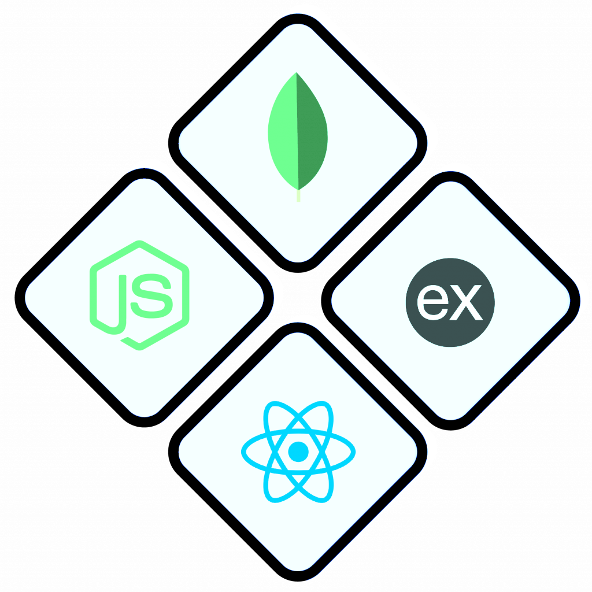

# Barchemy

<div align="center">
      
</div>
[![Codecool](https://img.shields.io/badge/-Codecool-black.svg?logo=data:image/svg%2Bxml;base64,PHN2ZyB4bWxucz0iaHR0cDovL3d3dy53My5vcmcvMjAwMC9zdmciIHZpZXdCb3g9IjAgMCAzMy42IDMzLjYxIj48ZGVmcz48c3R5bGU+LmNscy0xe2ZpbGw6IzAwMWRmZjt9PC9zdHlsZT48L2RlZnM+PGcgaWQ9IkxheWVyXzIiIGRhdGEtbmFtZT0iTGF5ZXIgMiI+PGcgaWQ9IkxheWVyXzEtMiIgZGF0YS1uYW1lPSJMYXllciAxIj48cGF0aCBjbGFzcz0iY2xzLTEiIGQ9Ik03LjI3LDkuNzJhNy41MSw3LjUxLDAsMCwxLC44LTMuNDIsNS42Nyw1LjY3LDAsMCwxLDEtMS4zOSw0NC4wOSw0NC4wOSwwLDAsMSwzLjUzLTMuNDRBNi41OSw2LjU5LDAsMCwxLDE3LjI4LDBhNi44Miw2LjgyLDAsMCwxLDMuODEsMS41M2MuMTYuMTQuMzMuMjguNDguNDRMMjUuMyw1LjcybDAsMHMwLDAsMCwwLDAsMCwwLDBoMGE3LjY3LDcuNjcsMCwwLDAtNCwwLDcuNTgsNy41OCwwLDAsMC0zLjQ0LDJsLTcuNzIsNy43MS0xLTFBNi43OCw2Ljc4LDAsMCwxLDcuMjcsOS43MloiLz48cGF0aCBjbGFzcz0iY2xzLTEiIGQ9Ik0yMy44OCw3LjMxYTcuMzgsNy4zOCwwLDAsMSwzLjQyLjgsNS42Nyw1LjY3LDAsMCwxLDEuMzksMSw0NC4wOSw0NC4wOSwwLDAsMSwzLjQ0LDMuNTMsNi41OSw2LjU5LDAsMCwxLDEuNDUsNC42OSw2LjgyLDYuODIsMCwwLDEtMS41MywzLjgxYy0uMTQuMTYtLjI4LjMyLS40NC40OGwtMy43MywzLjczLDAsMGgwczAsMCwwLDAsMCwwLDAsMGE3Ljc4LDcuNzgsMCwwLDAsMC00LDcuODgsNy44OCwwLDAsMC0yLTMuNDRsLTcuNzItNy43MSwxLTEuMDVhNi43OCw2Ljc4LDAsMCwxLDQuNzktMS43OVoiLz48cGF0aCBjbGFzcz0iY2xzLTEiIGQ9Ik0yNi4zMywyMy44OWE3LjQxLDcuNDEsMCwwLDEtLjgsMy40Miw1LjQ0LDUuNDQsMCwwLDEtMSwxLjM4QTQyLjU2LDQyLjU2LDAsMCwxLDIxLDMyLjE0YTYuNjMsNi42MywwLDAsMS00LjY5LDEuNDUsNi44Miw2LjgyLDAsMCwxLTMuODEtMS41M2MtLjE2LS4xNC0uMzMtLjI4LS40OC0uNDRMOC4zLDI3Ljg5czAsMCwwLDAsMCwwLDAsMGwwLDBoMGE3LjcyLDcuNzIsMCwwLDAsNy40Mi0ybDcuNzEtNy43MiwxLjA1LDEuMDVhNi43OCw2Ljc4LDAsMCwxLDEuNzksNC43OVoiLz48cGF0aCBjbGFzcz0iY2xzLTEiIGQ9Ik05LjcyLDI2LjI5QTcuMzcsNy4zNywwLDAsMSw2LjMsMjUuNWE1LjY3LDUuNjcsMCwwLDEtMS4zOS0xQTQ0LjA5LDQ0LjA5LDAsMCwxLDEuNDcsMjEsNi41OSw2LjU5LDAsMCwxLDAsMTYuMjlhNi44Miw2LjgyLDAsMCwxLDEuNTMtMy44MWMuMTQtLjE2LjI4LS4zMy40NC0uNDhMNS43Miw4LjI3bDAsMGgwczAsMCwwLDBhMCwwLDAsMCwxLDAsMCw3Ljc1LDcuNzUsMCwwLDAsMiw3LjQybDcuNzEsNy43Mi0xLDEuMDVhNi43Miw2LjcyLDAsMCwxLTQuNzksMS43OFoiLz48L2c+PC9nPjwvc3ZnPg==)](https://www.codecool.com/)

A fullstack MERN application for managing your home bar inventory, exploring classic and modern cocktail recipes.

[Request Feature](https://github.com/bramlak/barchemy/issues)

## Table of Contents

1. [About the Project](#about-the-project)
2. [Tech Stack](#tech-stack)
3. [Prerequisites](#prerequisites)
4. [Installation](#installation)
5. [Usage](#usage)
6. [Project Structure](#project-structure)
7. [Future Plans](#future-plans)
8. [Contributing](#contributing)
9. [Acknowledgments](#acknowledgments)

## About the Project

Barchemy is a liquor cabinet management system. It helps users track ingredients with quantities. Users can explore recipes, mix cocktails, and automatically deduct used amounts from inventory. The app includes about 90 recipes and 150 ingredients.

Data comes from the International Bartenders Association (IBA) official cocktails. Sourced from [rasmusab/iba-cocktails](https://github.com/rasmusab/iba-cocktails) (IBA website version). Processed for standardization using KNIME for analysis and Python for cleaning and unit conversions.

This is a MERN stack application. Backend uses Express.js with modular structure. Frontend built with React, frontend routing and Tailwind CSS. Data processing scripts prepare and populate the MongoDB database.

## Tech Stack

| Category | Technologies |
|----------|--------------|
| Backend | <a href="https://www.mongodb.com/"></a> <a href="https://expressjs.com/"></a> <a href="https://nodejs.org/"></a> |
| Frontend | <a href="https://react.dev/"></a> <a href="https://tailwindcss.com/"></a> |
| Data Processing | <a href="https://www.python.org/"></a> |
| Future Infrastructure | <a href="https://www.terraform.io/"></a> <a href="https://aws.amazon.com/ecs/"></a> <a href="https://github.com/features/actions"></a> |

## Prerequisites

- [Node.js](https://nodejs.org/) and npm.
- [MongoDB](https://www.mongodb.com/) (local or cloud instance).
- [Python](https://www.python.org/) (v3.0 or later) for data processing.
- Git for cloning the repository.

## Installation

### Clone the Repository

```
git clone https://github.com/bramlak/barchemy.git
cd barchemy
```
### Configure environment variables

```
cp .env.exapmle .env
```
Modify `.env` variables

### Data Processing

1. Navigate to the data directory:
   ```
   cd data
   ```
2. Install Python dependencies:
   ```
   pip install -r requirements.txt
   ```
3. Generate processed data (creates JSON files for units, recipes, ingredients):
   ```
   python scripts/generate_processed_data.py
   ```
4. Populate the MongoDB database (ensure MongoDB is running):
   ```
   python scripts/populate_db.py
   ```

### Backend Setup

1. Navigate to the backend directory:
   ```
   cd ../backend
   ```
2. Install dependencies:
   ```
   npm install
   ```
3. Start the server:
   ```
   npm start
   ```

### Frontend Setup

1. Navigate to the frontend directory:
   ```
   cd ../frontend
   ```
2. Install dependencies:
   ```
   npm install
   ```
3. Start the development server:
   ```
   npm run dev
   ```

## Usage

- Access the app at `http://localhost:5173` (default frontend port).
- Use the Home page for overview.
- Add/edit ingredients and quantities, browse and filter recipes on the Bar page.
- Select a recipe to mix: app deducts ingredients from inventory.
- About page provides more details.

For API usage, backend runs at `http://localhost:3000`. Endpoints include `/ingredient`, `/recipe`.

## Project Structure

- **data/**: Raw and processed data, scripts for cleaning and DB population.
  - Raw: CSV from IBA source.
  - Processed: JSON for DB collections.
  - Config: Units and conversions.
  - Scripts: Python files for processing.
  - Analysis: KNIME workflow for data exploration.
- **backend/**: Express.js server.
  - Modules: Ingredient, Recipe, Unit (controllers, models, etc.).
  - Core: Error handling.
  - Routes: API endpoints.
- **frontend/**: React app with Tailwind CSS.
  - Pages: Home, Bar, About.
  - Components: Inventory, Recipe filters, etc.
  - API: Hooks for data fetching.
- **infrastructure/**: Planned for Terraform and ECS.

## Future Plans

- Complete frontend features with advanced search.
- Implement infrastructure as code using Terraform for AWS ECS deployment.
- Set up CI/CD pipelines with GitHub Actions for automated builds and deployments.
- User system with recipe history, inventory storage and more
## Contributing

Fork the repo. Create a feature branch. Commit your changes. Push to the branch. Open a pull request.

## Acknowledgments

- Data from [IBA Cocktails](https://github.com/rasmusab/iba-cocktails).